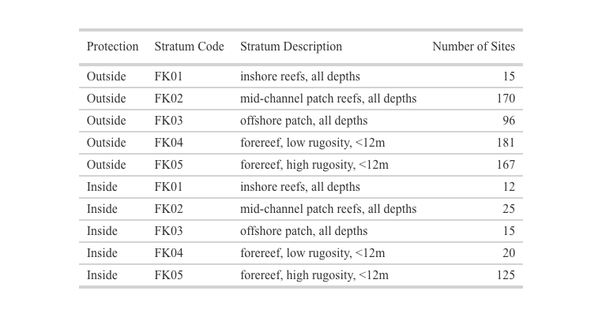
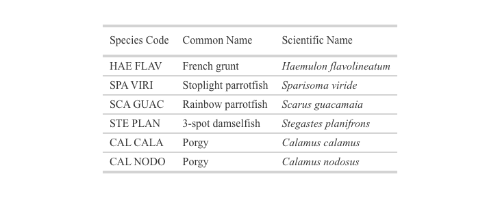

```{r setup, include=FALSE}
knitr::opts_chunk$set(warning = FALSE, message = FALSE)
# Needed Libraries
library(rvc)
library(tidyverse)
library(DT)
library(gt)

# Source Plotting Functions
source('code/labeler.R', local = knitr::knit_global())
source('code/QL_binned_LengthFreq.R', local = knitr::knit_global())
source('code/theme_publication.R', local = knitr::knit_global())
source('code/WrapperFunctions.R', local = knitr::knit_global())
source('code/MIR_Plot_functions.R', local = knitr::knit_global())

# Read in MIR data set
MIR_data <- readRDS("../data/MIR_Dataset.rds")
```

## The Data

The RVC, stationary-point-count method is modified from Bohnsack and Bannerot (1986) and is conducted on shallow (<100ft), hardbottom coral reef habitats. Field surveys use a one-stage design to sample 50 m x 50 m grid cells selected using a stratified-random sampling allocation. This data set represents sample locations in the Florida Keys. Only those strata types found within the MIR areas were considered (table 1).

*Table 1. Number of Sites Sampled*
```{r echo=FALSE}
table <- MIR_data$sample_data %>%
  group_by(PROT, STRAT) %>%
  summarise(n = length(unique(PRIMARY_SAMPLE_UNIT)), .groups = "drop") %>%
  mutate(
    description = case_when(
      STRAT == "FK01" ~ "inshore reefs, all depths",
      STRAT == "FK02" ~ "mid-channel patch reefs, all depths",
      STRAT == "FK03" ~ "offshore patch, all depths",
      STRAT == "FK04" ~ "forereef, low rugosity, <12m",
      STRAT == "FK05" ~ "forereef, high rugosity, <12m"
    ),
    PROT = case_when(
      PROT == 0 ~ "Outside",
      PROT == 1 ~ "Inside"
    )
  ) %>%
  select(PROT, STRAT, description, n)

gt_table <- table %>%
  gt() %>%
  cols_label(
    PROT = "Protection",
    STRAT = "Stratum Code",
    description = "Stratum Description",
    n = "Number of Sites"
  ) %>%
  tab_options(
    table.font.size = px(8),
    data_row.padding = px(2)
  ) %>%
  tab_style(
    style = cell_text(
      font = "Times New Roman",  
      size = px(8)     
    ),
    locations = cells_column_labels()  
  ) %>%
  tab_style(
    style = cell_text(
      font = "Times New Roman",  
      size = px(8)  
    ),
    locations = cells_body()
  )
  
gtsave(gt_table, filename = "table1_sites_sampled.png", expand = 50)

```


## Fish Species

A selection of fish species were chosen to represent different trophic levels and functional roles. 

*Table 2. Fish species. For analysis, both porgy species were combined.*
```{r echo=FALSE}
spp_list <- tribble(
  ~SPECIES_CD, ~CommonName, ~SciName,
  "HAE FLAV", "French grunt", "Haemulon flavolineatum",
  "SPA VIRI", "Stoplight parrotfish", "Sparisoma viride",
  "SCA GUAC", "Rainbow parrotfish", "Scarus guacamaia", 
  "STE PLAN", "3-spot damselfish", "Stegastes planifrons",
  "CAL CALA", "Porgy", "Calamus calamus",
  "CAL NODO", "Porgy", "Calamus nodosus"
) %>%
as.data.frame()

gt_spp_list <- spp_list %>%
  gt() %>%
  cols_label(
    SPECIES_CD = "Species Code",
    CommonName = "Common Name",
    SciName = "Scientific Name"
  ) %>%
  tab_options(
    table.font.size = px(8),
    data_row.padding = px(2)
  ) %>%
  tab_style(
    style = cell_text(
      font = "Times New Roman",  
      size = px(8)     
    ),
    locations = cells_column_labels() 
  ) %>%
  tab_style(
    style = cell_text(
      font = "Times New Roman",  
      size = px(8)  
    ),
    locations = cells_body()
  ) %>% 
 tab_style(
    style = cell_text(
      font = "Times New Roman", 
      style = "italic",  
      size = px(8)
    ),
    locations = cells_body(columns = vars(SciName))  
  )

gtsave(gt_spp_list, filename = "table2_species_list.png", expand = 75)

```


## Density
Density is represented as the number of individuals per 177 m^2.

```{r, echo=FALSE, fig.show="hold", out.width="90%"}
MIR_domain_dens_by_year(MIR_data, spp_list)
```

\vspace{0.5cm}

## Occurrence
Survey occurrence within MIR sites and outside. 

```{r, echo=FALSE, fig.show="hold", out.width="90%"}
MIR_domain_occ_by_year(MIR_data, spp_list)
```

## Length Frequency {.tabset}
Relative length frequency of species within MIR sites and outside. 

### French Grunt
```{r, echo=FALSE, fig.show="hold", out.width="50%"} 
MIR_LF(df = MIR_data, spp = "hae flav", bin_size = 5, yrs = 2022, spp_name = "French grunt")
MIR_LF(df = MIR_data, spp = "hae flav", bin_size = 5, yrs = 2024, spp_name = "French grunt")
```

### Stoplight Parrotfish
```{r, echo=FALSE, fig.show="hold", out.width="50%"} 
MIR_LF(df = MIR_data, spp = "spa viri", bin_size = 5, yrs = 2022, spp_name = "Stoplight parrotfish")
MIR_LF(df = MIR_data, spp = "spa viri", bin_size = 5, yrs = 2024, spp_name = "Stoplight parrotfish")
```

### Rainbow Parrotfish
```{r, echo=FALSE, fig.show="hold", out.width="50%"} 
MIR_LF(df = MIR_data, spp = "sca guac", bin_size = 5, yrs = 2022, spp_name = "Rainbow parrotfish")
MIR_LF(df = MIR_data, spp = "sca guac", bin_size = 5, yrs = 2024, spp_name = "Rainbow parrotfish")
```

### 3-Spot Damselfish
```{r, echo=FALSE, fig.show="hold", out.width="50%"} 
MIR_LF(df = MIR_data, spp = "ste plan", bin_size = 2, yrs = 2022, spp_name = "3-spot damselfish")
MIR_LF(df = MIR_data, spp = "ste plan", bin_size = 2, yrs = 2024, spp_name = "3-spot damselfish")
```

### Porgy
```{r, echo=FALSE, fig.show="hold", out.width="50%"} 
MIR_data_copy <- MIR_data
MIR_data_copy$sample_data <- MIR_data_copy$sample_data %>%
  mutate(SPECIES_CD = if_else(SPECIES_CD == "CAL CALA", "CAL NODO", SPECIES_CD))
#Merged CAL CALA and CAL NODO to graph both porgy species together
MIR_LF(df = MIR_data_copy, spp = "CAL NODO", bin_size = 2, yrs = 2022, spp_name = "Porgy")
MIR_LF(df = MIR_data_copy, spp = "CAL NODO", bin_size = 2, yrs = 2024, spp_name = "Porgy")
```
